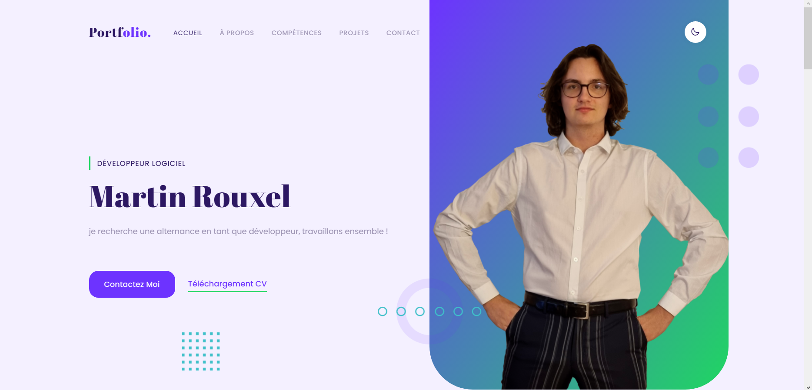
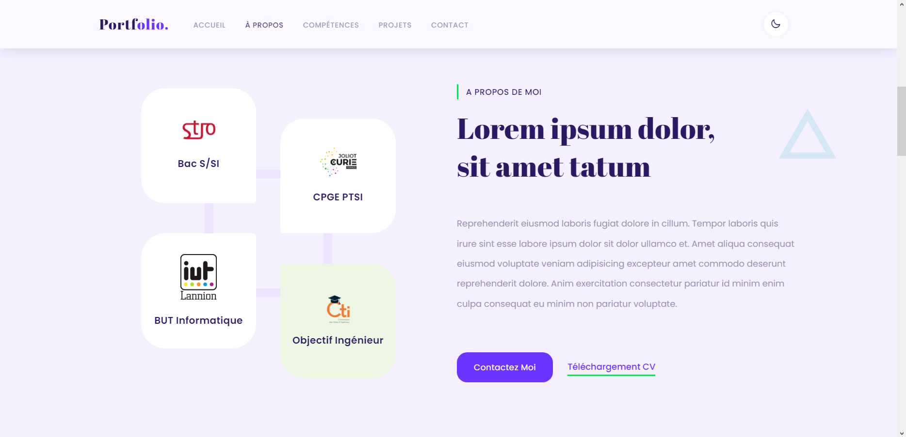
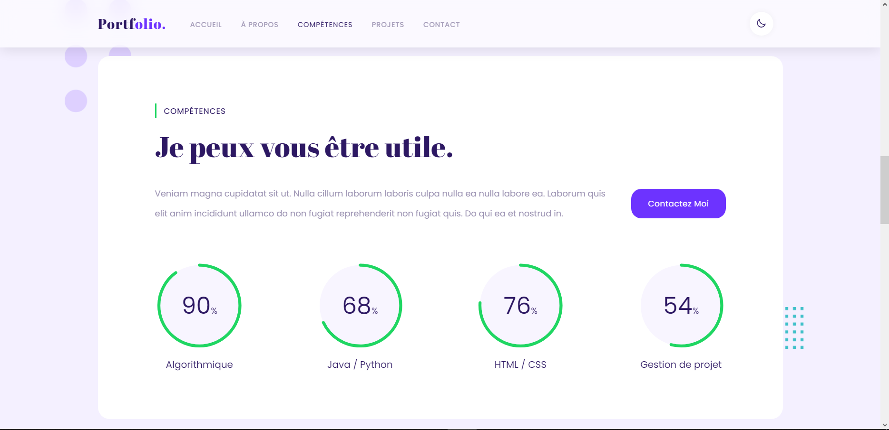
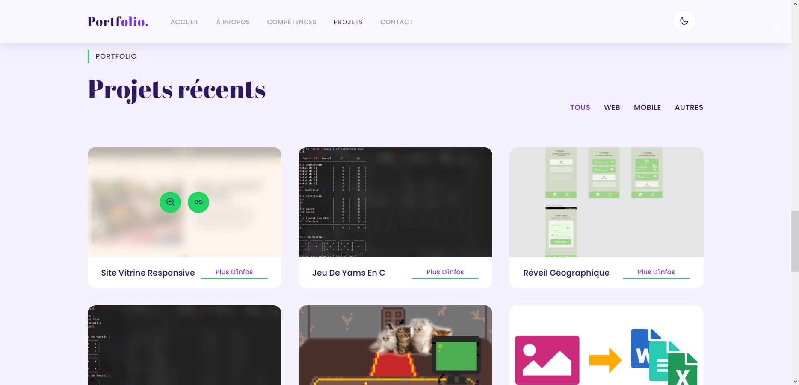
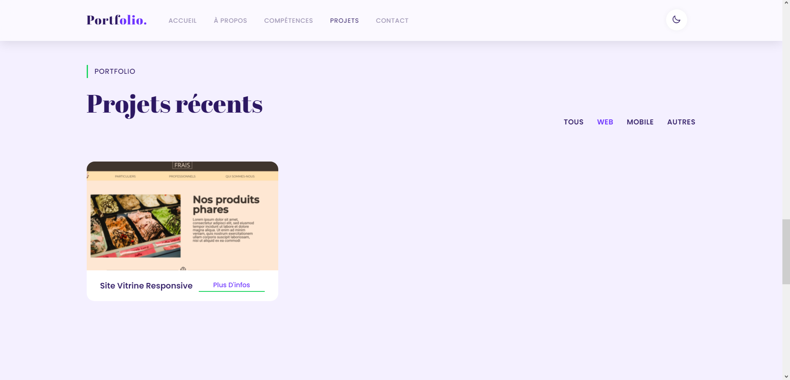
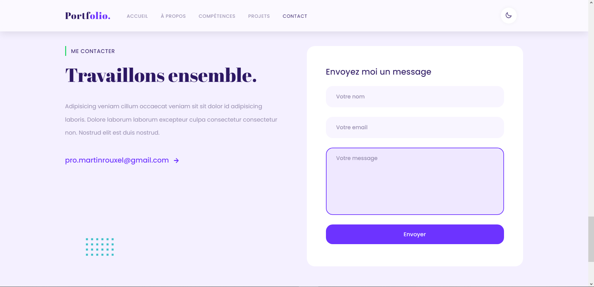
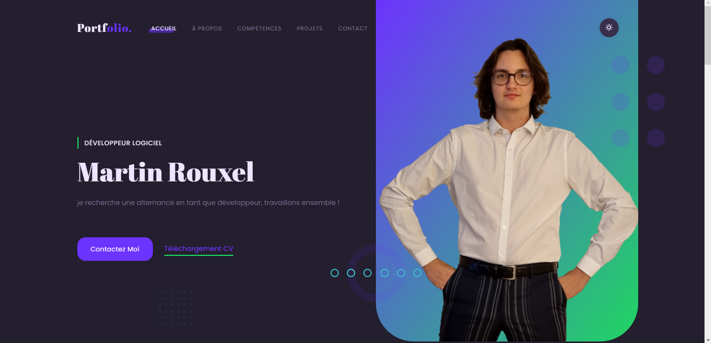
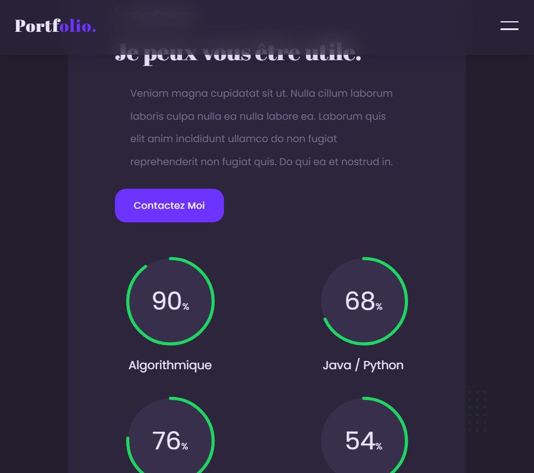
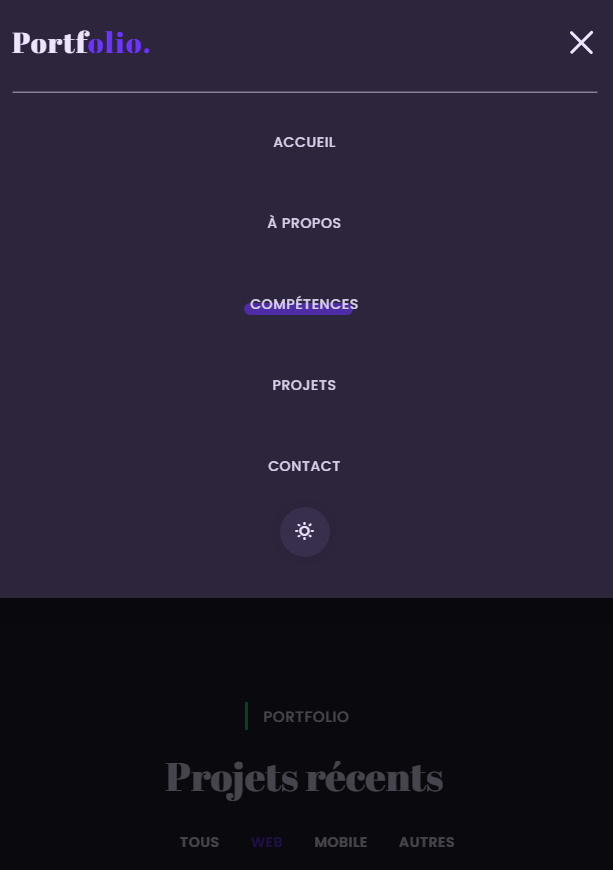

# Portfolio

Site portfolio responsive

## V1.1 : site plus responsive sur mobile

## maintenant hébergé à : <a href="martin-rouxel.com">martin-rouxel.com</a>

---

## (formulaire de contact désormais fonctionnel !)

## Captures du site :

Filtres pour projets

---

## Mode sombre:

---

## Responsivité :

écrans < 740px

écrans < 500px + hamburger

